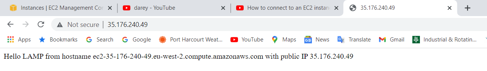

# LAMP Stack Implementation
## Introduction
A “LAMP” stack is a group of open-source software that is typically installed together to enable a server to host dynamic websites and web apps. This term is actually an acronym which represents the Linux operating system, with the Apache web server. The site data is stored in a MySQL database, and dynamic content is processed by PHP.

This project involves the use of an AWS EC2 instance of t2.micro family with Ubuntu Server 20.04 LTS (HVM).

## Prerequisites 
To complete this project you will need an AWS account and a virtual server with Ubuntu Server OS.
You would need to connect to your EC2 instance  


## Step 1 - Installing Apache and Updating the Firewall
Install Apache using Ubuntu’s package manager ‘apt’:

The below command updates a list of packages in package manager
```bash
sudo apt update
```


The below command to run apache2 package installation

```bash
sudo apt install apache2
```


After entering this command, apt will tell you which packages it plans to install and how much extra disk space they’ll take up. Press `Y`and hit `ENTER` to confirm, and the installation will proceed.


To verify that apache2 is running as a Service in our OS, use following command
```bash
sudo systemctl status apache2
```


If it is green and running, then you did everything correctly.

Open TCP port 80 which is the default port that web browsers use to access web pages on the Internet. Add a rule to EC2 configuration to open inbound connection through port 80:


Our server is running and we can access it locally and from the Internet (Source 0.0.0.0/0 means ‘from any IP address’).

To check how we can access it locally in our Ubuntu shell, run:
```bash
curl http://localhost:80
or
curl http://127.0.0.1:80
```


To test how the Apache HTTP server can respond to requests from the Internet.

Retrieve Public IP address by running the following command :
```bash
curl -s http://169.254.169.254/latest/meta-data/public-ipv4
```


The Public-IP-Address can also be copied from the EC2 instance on AWS


Open a web browser and try to access the following url

`http://<Public-IP-Address>:80`


## Step 2 Installing MySQL
Use ‘apt’ to acquire and install the mysql software:
```bash
sudo apt install mysql-server
``` 


This script will remove some insecure default settings and lock down access to your database system. Start the interactive script by running:
```bash
sudo mysql_secure_installation
```
When prompted, confirm installation by typing `Y`, and then `ENTER`.


This will ask if you want to configure the **VALIDATE PASSWORD PLUGIN**.

For the rest of the questions, press `Y` and hit the `ENTER` key at each prompt. This will remove some anonymous users and the test database, disable remote root logins, and load these new rules so that MySQL immediately respects the changes you have made.

When finished, test if able to log in to the MySQL console by typing:
```bash
sudo mysql
```


## Step 3 - Installing PHP
 In addition to the php package, php-mysql, a PHP module that allows PHP to communicate with MySQL-based databases, libapache2-mod-php which enables Apache to handle PHP files are needed. Core PHP packages will automatically be installed as dependencies. To get these packages run:

```bash
sudo apt install php libapache2-mod-php php-mysql
```


Once the installation is finished, run the following command to confirm your PHP version:
```bash
php -v
```
```bash
PHP 7.4.3 (cli) (built: Nov 25 2021 23:16:22) ( NTS )
Copyright (c) The PHP Group
Zend Engine v3.4.0, Copyright (c) Zend Technologies
    with Zend OPcache v7.4.3, Copyright (c), by Zend Technologies
ubuntu@ip-172-31-26-46:~$
```


LAMP stack is completely installed and fully operational.

## Step 4 -  Creating a virtual Host for your website using Apache
In this step, i set up a domain called projectlamp, to 

Apache on Ubuntu 20.04 has one server block enabled by default that is configured to serve documents from the /var/www/html directory.
We will leave this configuration as is and will add our own directory next next to the default one.

Create the directory for projectlamp using ‘mkdir’ command as follows:
```bash
sudo mkdir /var/www/projectlamp
```
Assign ownership of the directory with your current system user:
```bash
sudo chown -R $USER:$USER /var/www/projectlamp
```
Then, create and open a new configuration file in Apache’s *sites-available* directory using your preferred command-line editor. Here i used vim:
```bash
sudo vi /etc/apache2/sites-available/projectlamp.conf
```
This will created a new blank file. Pasted in the following bare-bones configuration by hitting on i on the keyboard to enter the insert mode, and pasted the text:
```bash
<VirtualHost *:80>
    ServerName projectlamp
    ServerAlias www.projectlamp 
    ServerAdmin webmaster@localhost
    DocumentRoot /var/www/projectlamp
    ErrorLog ${APACHE_LOG_DIR}/error.log
    CustomLog ${APACHE_LOG_DIR}/access.log combined
</VirtualHost>
```


To save and close the file, simply follow the steps below:
* Hit the esc button on the keyboard
* Type :
* Type wq. w for write and q for quit
* Hit ENTER to save the file

Use the `ls` command to show the new file in the sites-available directory:
```bash
$ sudo ls /etc/apache2/sites-available
```
command returned 
```bash
000-default.conf  default-ssl.conf  projectlamp.conf
```


use a2ensite command to enable the new virtual host:
```bash
sudo a2ensite projectlamp
```

To disable Apache’s default website use a2dissite command , type:
```bash
sudo a2dissite 000-default
```

To make sure your configuration file doesn’t contain syntax errors, run:
```bash
sudo apache2ctl configtest
```
Finally, reload Apache so these changes take effect:
```bash
sudo systemctl reload apache2
```
Create an index.html file in that location so that we can test that the virtual host works as expected:
```bash
sudo echo 'Hello LAMP from hostname' $(curl -s http://169.254.169.254/latest/meta-data/public-hostname) 'with public IP' $(curl -s http://169.254.169.254/latest/meta-data/public-ipv4) > /var/www/projectlamp/index.html
```
Go to your browser and try to open your website URL using IP address:
```bash
http://<Public-IP-Address>:80
```

## Step 5 - Enable PHP on the website
 To edit the */etc/apache2/mods-enabled/dir.conf* file and change the order in which the *index.php* file is listed within the DirectoryIndex directive:
 ```bash
 sudo vim /etc/apache2/mods-enabled/dir.conf
 ```
 After saving and closing the file, you will need to reload Apache so the changes take effect:
```bash
sudo systemctl reload apache2
```


Finally, we will create a PHP script to test that PHP is correctly installed and configured on your server.

Create a PHP test script to confirm that Apache is able to handle and process requests for PHP files.

Create a new file named index.php inside your custom web root folder:
```bash
vim /var/www/projectlamp/index.php
```

Add the following text, which is valid PHP code, inside the file:
```bash
<?php
phpinfo();
```
When finished, save and close the file, refresh the opened page on your browser:


To remove the file you created as it contains sensitive information about your PHP environment -and your Ubuntu server. You can use `rm` to do so:
```bash
sudo rm /var/www/projectlamp/index.php
```
