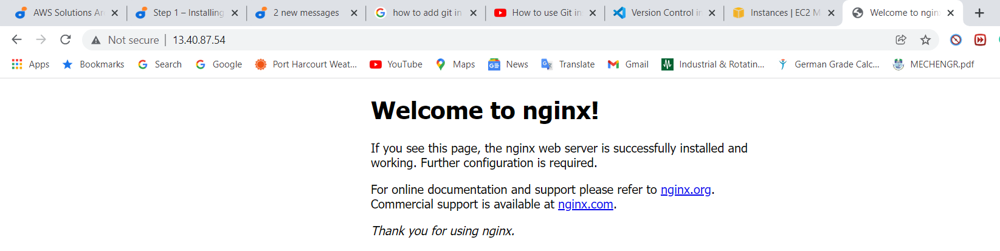
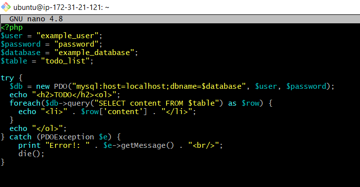
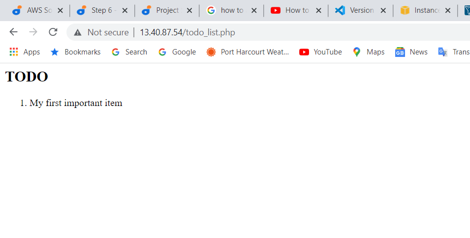

# LEMP Stack Implementation
## Introduction
The LEMP software stack is a group of software that can be used to serve dynamic web pages and web applications written in PHP. This is an acronym that describes a Linux operating system, with an Nginx (pronounced like “Engine-X”) web server. The backend data is stored in the MySQL database and the dynamic processing is handled by PHP.
## Prerequisites
* An AWS account and a virtual server with Ubuntu Server OS.
* Git Bash to connect the AWS EC2 instance.
## Step 1 – Installing the Nginx Web Server
Use apt install to get Nginx installed:
```bash
sudo apt update
sudo apt install nginx
```


To verify that nginx was successfully installed and is running as a service in Ubuntu, run:
```bash
sudo systemctl status nginx
```
If it is green and running, then everything was done correctly.


To access the server locally in our Ubuntu shell, run:
 ```bash
 curl http://localhost:80
 ```


To test how our Nginx server can respond to requests from the Internet.
Open a web browser and try to access following url:
```bash
http://<Public-IP-Address>:80
```
If you see following page, then your web server is now correctly installed and accessible through your firewall.



## Step 2 — Installing MySQL
To install Mysql run:
```bash
sudo apt install mysql-server
```


To run a security script that comes pre-installed with Mysql for removal of some insecure default settings and to lock down access to your database system:
```bash
sudo mysql_secure_installation
```


When finished, test if you’re able to log in to the MySQL console by typing:
```bash
sudo mysql
```


You should see output like this:
```bash
Welcome to the MySQL monitor.  Commands end with ; or \g.
Your MySQL connection id is 22
Server version: 8.0.22-0ubuntu0.20.04.3 (Ubuntu)

Copyright (c) 2000, 2020, Oracle and/or its affiliates. All rights reserved.

Oracle is a registered trademark of Oracle Corporation and/or its
affiliates. Other names may be trademarks of their respective
owners.

Type 'help;' or '\h' for help. Type '\c' to clear the current input statement.

mysql> 
```
To exit the Mysql console, type:
```bash
mysql> exit
```
MySQL server is now installed and secured.
## Step 3 – Installing PHP
In addition to the php package, php-mysql a PHP module that allows PHP to communicate with MySQL-based databases, php-fpm which stands for “PHP fastCGI process manager” are needed. Core PHP packages will automatically be installed as dependencies. 

To install these 2 packages at once, run:
```bash
sudo apt install php-fpm php-mysql
```


## Step 4 — Configuring Nginx to Use PHP Processor
Create the root web directory for your_domain as follows:
```bash
sudo mkdir /var/www/projectLEMP
```
Assign ownership of the directory with the $USER environment variable, which will reference your current system user:
```bash
sudo chown -R $USER:$USER /var/www/projectLEMP
```
Then, open a new configuration file in Nginx’s sites-available directory using your preferred command-line editor. Here, we’ll use nano:
```bash
sudo nano /etc/nginx/sites-available/projectLEMP
```
This will create a new blank file. Paste in the following bare-bones configuration:

```bash
#/etc/nginx/sites-available/projectLEMP

server {
    listen 80;
    server_name projectLEMP www.projectLEMP;
    root /var/www/projectLEMP;

    index index.html index.htm index.php;

    location / {
        try_files $uri $uri/ =404;
    }

    location ~ \.php$ {
        include snippets/fastcgi-php.conf;
        fastcgi_pass unix:/var/run/php/php7.4-fpm.sock;
     }

    location ~ /\.ht {
        deny all;
    }

}
```


Activate your configuration by linking to the config file from Nginx’s sites-enabled directory:
```bash
sudo ln -s /etc/nginx/sites-available/projectLEMP /etc/nginx/sites-enabled/
```
Test configuration for syntax errors by typing:
```bash
sudo nginx -t
```
You shall see following message:
```bash
nginx: the configuration file /etc/nginx/nginx.conf syntax is ok
nginx: configuration file /etc/nginx/nginx.conf test is successful
```
To disable default Nginx host that is currently configured to listen on port 80, for this run:
```bash
sudo unlink /etc/nginx/sites-enabled/default
```
 To reload Nginx to apply the changes:
```bash
sudo systemctl reload nginx
```
Create an index.html file in the location of  web root /var/www/projectLEMP so that we can test that your new server block works as expected:
```bash
sudo echo 'Hello LEMP from hostname' $(curl -s http://169.254.169.254/latest/meta-data/public-hostname) 'with public IP' $(curl -s http://169.254.169.254/latest/meta-data/public-ipv4) > /var/www/projectLEMP/index.html
```


Open up a browser and try to open your website URL using IP address:
`http://<Public-IP-Address>:80`


## Step 5 – Testing PHP with Nginx
To a test PHP file in your document root. Open a new file called info.php within your document root in your text editor:
```bash
sudo nano /var/www/projectLEMP/info.php
```
Type or paste the following lines into the new file. This is valid PHP code that will return information about your server:
```bash
<?php
phpinfo();
```


To access this page in your web browser by visiting input the domain name or public IP address you’ve set up in your Nginx configuration file, followed by /info.php:

`http://`server_domain_or_IP`/info.php`


It’s best to remove the file you created as it contains sensitive information about your PHP environment and your Ubuntu server. You can use rm to remove that file:
```bash
sudo rm /var/www/your_domain/info.php
```


## Step 6 — Retrieving data from MySQL database with PHP
Connect to the MySQL console using the root account:
```bash
sudo mysql
```
To create a new database, run the following command from your MySQL console:

```bash
mysql> CREATE DATABASE `example_database`;
```


The following command creates a new user named example_user, using mysql_native_password as default authentication method.
```bash
mysql>  CREATE USER 'example_user'@'%' IDENTIFIED WITH mysql_native_password BY 'password';
```
To give this user permission over the example_database database:
```bash
mysql> GRANT ALL ON example_database.* TO 'example_user'@'%';
```
Exit the MySQL shell with:
```bash
mysql> exit
```
Test if the new user has the proper permissions by logging in to the MySQL console again, this time using the custom user credentials:
```bash
mysql -u example_user -p
```
After logging in to the MySQL console, confirm that you have access to the example_database database:
```bash
mysql> SHOW DATABASES;
```
This will give you the following output:
```bash
Output
+--------------------+
| Database           |
+--------------------+
| example_database   |
| information_schema |
+--------------------+
2 rows in set (0.000 sec)
```
Create a test table named todo_list. From the MySQL console, run the following statement:
```bash
CREATE TABLE example_database.todo_list (item_id INT AUTO_INCREMENT,content VARCHAR(255), PRIMARY KEY(item_id));
```


Insert a few rows of content in the test table.
```bash
mysql> INSERT INTO example_database.todo_list (content) VALUES ("My first important item");
```
To confirm that the data was successfully saved to your table, run:
```bash
mysql>  SELECT * FROM example_database.todo_list;
```
You’ll see the following output:
```bash
Output
+---------+--------------------------+
| item_id | content                  |
+---------+--------------------------+
|       1 | My first important item  |
+---------+--------------------------+
1 row in set (0.000 sec)
```


After confirming that you have valid data in your test table, you can exit the MySQL console:
```bash
mysql> exit
```
Create a PHP script that will connect to MySQL and query for your content:
```bash
nano /var/www/projectLEMP/todo_list.php
```


Copy this content into your <span style="color:blue">todo_list.php</span> script:
```bash
<?php
$user = "example_user";
$password = "password";
$database = "example_database";
$table = "todo_list";

try {
  $db = new PDO("mysql:host=localhost;dbname=$database", $user, $password);
  echo "<h2>TODO</h2><ol>";
  foreach($db->query("SELECT content FROM $table") as $row) {
    echo "<li>" . $row['content'] . "</li>";
  }
  echo "</ol>";
} catch (PDOException $e) {
    print "Error!: " . $e->getMessage() . "<br/>";
    die();
}
```
Save and close the file when you are done editing.



Access the page in your web browser by visiting the domain name or public IP address configured for your website, followed by /todo_list.php:

`http://<Public_domain_or_IP>/todo_list.php`



