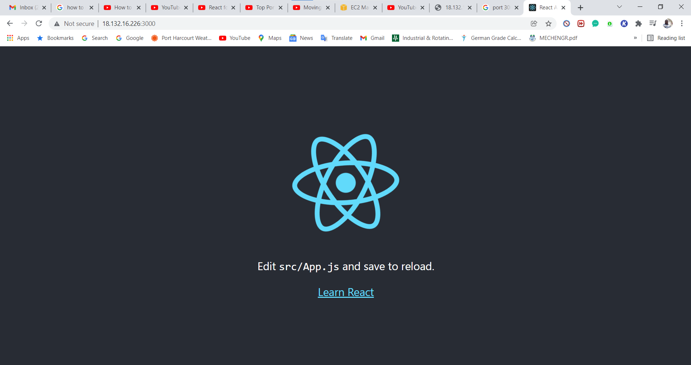

# MERN Stack Implementation
## Introduction 
___

This project is an implementation of a web solution based on MERN stack in AWS Cloud. I would be deploying a Simple Todo application using the technologies that are together called MERN stack. The MERN stack is an acronym for MongoDB is a document-based, No-SQL database used to store application data in a form of documents, Expressjs a server side Web Application framework for Node.js, Reactjs a frontend framework developed by Facebook. It is based on JavaScript, used to build User Interface (UI) components, and Nodejs a JavaScript runtime environment. It is used to run JavaScript on a machine rather than in a browser. 
## Prerequisites
* An AWS account and a virtual server with Ubuntu Server OS.
* A terminal to connect the AWS EC2 instance, i would be using the windows powershell for this project.
* Connect to your AWS EC2 instance

## Step 1 - Backend configuration
Update ubuntu 
```bash
sudo apt update
```

Upgrade ubuntu
```bash
sudo apt upgrade
```

Get the location of Node.js software from [Ubuntu repositories](https://github.com/nodesource/distributions#deb).
```bash
curl -sL https://deb.nodesource.com/setup_12.x | sudo -E bash -
```

Install Node.js on the server
```bash
sudo apt-get install -y nodejs
```
The command above installs both nodejs and npm. NPM is a package manager for Node like apt for Ubuntu, it is used to install Node modules & packages and to manage dependency conflicts.


To verify the node installation run the command below
```bash
node -v
```

To verify the node installation run the command below
```bash
npm -v 
```
___
Application Code Setup
___

Create a new directory for the To-Do project:
```bash
mkdir Todo
```

Verify that the Todo directory is created with ls command
```bash
ls
```

Change your current directory to the newly created one:
```bash
cd Todo
```

Use the command below to initialise your project, a new file named package.json will be created:
```bash
npm init
```
Run the ls command to confirm that the package.json file was created.


___
Installing Expressjs
___ 
Install Expressjs using npm:
```bash
npm install express
```
Create a file index.js with the command below:
```bash
touch index.js
```
Install dotenv module
```bash
npm install dotenv
```
Open the index.js file with the command below:
```bash
vim index.js
```
Type the code below into it and save.
```bash
const express = require('express');
require('dotenv').config();

const app = express();

const port = process.env.PORT || 5000;

app.use((req, res, next) => {
res.header("Access-Control-Allow-Origin", "\*");
res.header("Access-Control-Allow-Headers", "Origin, X-Requested-With, Content-Type, Accept");
next();
});

app.use((req, res, next) => {
res.send('Welcome to Express');
});

app.listen(port, () => {
console.log(`Server running on port ${port}`)
});
```
Start the server to see if it works. Navigate to same directory as your index.js file and type:
```bash
node index.js
```
If every thing goes well, you should see Server running on port 5000 in the terminal.


Open port 5000 in the EC2 Security Groups, this enables access to your sever through port 5000.

Open up a browser and try to access the server’s Public IP or Public DNS name followed by port 5000:

`http://<PublicIP-or-PublicDNS>:5000`

You can find the PublicIP or PublicDNS in your AWS web console in EC2 details, or run the command below:
```bash
curl -s http://169.254.169.254/latest/meta-data/public-ipv4
```
for Public IP address or 
```bash
curl -s http://169.254.169.254/latest/meta-data/public-hostname
```
for Public DNS name.


___
Routes
___

There are three actions that the To-Do application needs to be able to do:

1. Create a new task
2. Display list of all tasks
3. Delete a completed task

Each task will be associated with some particular endpoint and will use different standard HTTP request methods: POST, GET, DELETE.

For each task, we need to create routes that will define various endpoints that the To-do app will depend on. 

Create a folder routes with the command below:
```bash
mkdir routes
```
Change directory to routes folder.
```bash
cd routes
```
Create a file api.js with the command below
```bash
touch api.js
```

Open the file with the command below
```bash
vim api.js
```
Copy below code in the file.

```bash
const express = require ('express');
const router = express.Router();

router.get('/todos', (req, res, next) => {

});

router.post('/todos', (req, res, next) => {

});

router.delete('/todos/:id', (req, res, next) => {

})

module.exports = router;
```


___
Models
___
Since the app is going to make use of Mongodb which is a NoSQL database, we need to create a model.

A model is at the heart of JavaScript based applications, and it is what makes it interactive.
We will also use models to define the database schema.

To create a Schema and a model, install mongoose which is a Node.js package that makes working with mongodb easier.

Navigate to the Todo folder directory and install Mongoose:
```bash
npm install mongoose
```

Create a new folder models :
```bash
mkdir models
```

Change directory into the newly created ‘models’ folder with
```bash
cd models
```
Inside the models folder, create a file and name it todo.js
```bash
touch todo.js
```
Open the file created with vim then paste the code below in the file:
```bash
const mongoose = require('mongoose');
const Schema = mongoose.Schema;

//create schema for todo
const TodoSchema = new Schema({
action: {
type: String,
required: [true, 'The todo text field is required']
}
})

//create model for todo
const Todo = mongoose.model('todo', TodoSchema);

module.exports = Todo;
```
Update the routes from the file api.js in ‘routes’ directory to make use of the new model.

In Routes directory, open api.js with `vim api.js`, delete the code inside and paste the code below.
```bash
const express = require ('express');
const router = express.Router();
const Todo = require('../models/todo');

router.get('/todos', (req, res, next) => {

//this will return all the data, exposing only the id and action field to the client
Todo.find({}, 'action')
.then(data => res.json(data))
.catch(next)
});

router.post('/todos', (req, res, next) => {
if(req.body.action){
Todo.create(req.body)
.then(data => res.json(data))
.catch(next)
}else {
res.json({
error: "The input field is empty"
})
}
});

router.delete('/todos/:id', (req, res, next) => {
Todo.findOneAndDelete({"_id": req.params.id})
.then(data => res.json(data))
.catch(next)
})

module.exports = router;
```


____
MongoDB Database
____
A database is needed for storage of data. For this i would make use of mLab. mLab provides MongoDB database as a service solution (DBaaS). 

Signup on mlab Atlas, and create a MongoDB database and collection inside mLab. 

In the index.js file, we specified process.env to access environment variables, but we have not yet created this file.

Create a file in the Todo directory and name it .env.
```bash
touch .env
vi .env
```
Add the connection string to access the database in it, just as below:

```bash
DB = 'mongodb+srv://<username>:<password>@<network-address>/<dbname>?retryWrites=true&w=majority'
```
Ensure to update <username>, <password>, <network-address> and <database> according to the setup.

Update the index.js to reflect the use of .env so that Node.js can connect to the database.

Delete the text in index.js and paste the code below:
```bash
const express = require('express');
const bodyParser = require('body-parser');
const mongoose = require('mongoose');
const routes = require('./routes/api');
const path = require('path');
require('dotenv').config();

const app = express();

const port = process.env.PORT || 5000;

//connect to the database
mongoose.connect(process.env.DB, { useNewUrlParser: true, useUnifiedTopology: true })
.then(() => console.log(`Database connected successfully`))
.catch(err => console.log(err));

//since mongoose promise is depreciated, we overide it with node's promise
mongoose.Promise = global.Promise;

app.use((req, res, next) => {
res.header("Access-Control-Allow-Origin", "\*");
res.header("Access-Control-Allow-Headers", "Origin, X-Requested-With, Content-Type, Accept");
next();
});

app.use(bodyParser.json());

app.use('/api', routes);

app.use((err, req, res, next) => {
console.log(err);
next();
});

app.listen(port, () => {
console.log(`Server running on port ${port}`)
});
```
Start your server using the command:
```bash
node index.js
```
You should see a message ‘Database connected successfully’

___
Testing Backend Code without Frontend using RESTful API
___
In this project i made use of Postman to to test the API.

There are 3 things to achieve by the use of Postman.

* Display a list of tasks – HTTP GET request
* Add a new task to the list – HTTP POST request
* Delete an existing task from the list – HTTP DELETE request

Open up Postman, create a POST request to the API `http://<PublicIP-or-PublicDNS>:5000/api/todos`. This request sends a new task to our To-Do list so the application could store it in the database.


Create a GET request to the API on http://<PublicIP-or-PublicDNS>:5000/api/todos. This request retrieves all existing records from out To-do application.

[Screenshot9](Media/Project3/Screenshot9.png)

Create a DELETE request to the API on http://<PublicIP-or-PublicDNS>:5000/api/todos. This request deletes specified existing records from out To-do application.


## Step 2 - Frontend Creation
To start out with the frontend of the To-do app, we will use the create-react-app command to scaffold our app.

In the same root directory as your backend code, which is the Todo directory, run:
```bash
 npx create-react-app client
```
___
Running a React App
____
Install concurrently. It is used to run more than one command simultaneously from the same terminal window.
```bash
npm install concurrently --save-dev
```
Install nodemon. It is used to run and monitor the server. If there is any change in the server code, nodemon will restart it automatically and load the new changes.
```bash
npm install nodemon --save-dev
```
In Todo folder open the package.json file. Change the scripts handle to the code below
```bash
"scripts": {
"start": "node index.js",
"start-watch": "nodemon index.js",
"dev": "concurrently \"npm run start-watch\" \"cd client && npm start\""
},
```


____
Configure Proxy in package.json
____
Change directory to ‘client’
```bash
cd client
```
Open the package.json file
```bash
vi package.json
```
Add the key value pair in the package.json file "proxy": "http://localhost:5000".

The whole purpose of adding the proxy configuration above is to make it possible to access the application directly from the browser by simply calling the server url like http://localhost:5000 rather than always including the entire path like http://localhost:5000/api/todos

Run the React app with the code below

First, ensure you are inside the Todo directory:
```bash
npm run dev
```


Your app should open and start running on localhost:3000


___
Creating React Components
___
From your Todo directory run
```bash
cd client
```
move to the src directory
```bash
cd src
```
Inside your src folder create another folder called components
```bash
mkdir components
```
Move into the components directory with
```bash
cd components
```
Inside ‘components’ directory create three files Input.js, ListTodo.js and Todo.js.
```bash
touch Input.js ListTodo.js Todo.js
```


Input code into various files

To make use of Axios, which is a Promise based HTTP client for the browser and node.js, you need to cd into your client from your terminal and run yarn add axios or npm install axios.

Move to clients folder

Install Axios
```bash
npm install axios
```
We need to make little adjustment to our react code. Delete the logo and adjust our App.js.


Go to the Todo directory and run:
```bash
npm run dev
```


