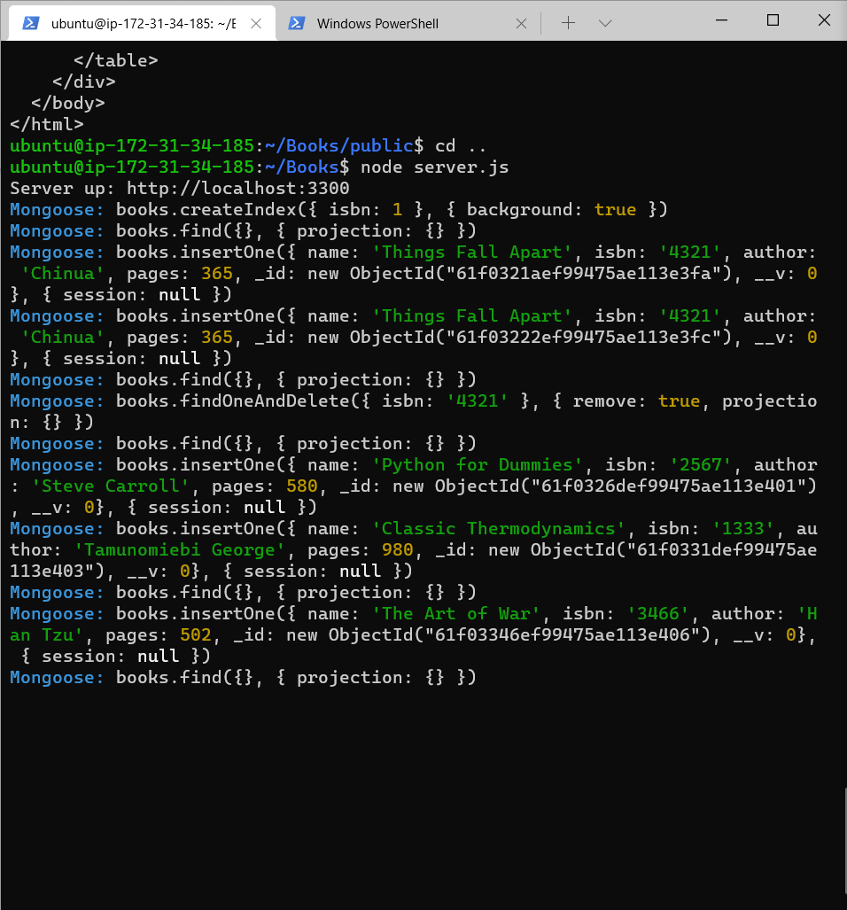

# MEAN Stack Implementation
## Introduction 
MEAN Stack is a collection software technologies for building dynamic web sites and web applications. MEAN is an acronym for MongoDB a document database that stores and allows retrieval data. Express a back-end application framework that makes requests to Databases  for Reads and Writes. Angular  a front-end application framework that handles Client and Server Requests. Node.js a JavaScript runtime environment that accepts requests and displays results to end users.
## Prerequisites
* An AWS account and a virtual server with Ubuntu Server OS.
* A terminal to connect the AWS EC2 instance, i would be using the windows powershell for this project.
* Connect to your AWS EC2 instance
## Step 1 - Installing NodeJs
Update ubuntu
```bash
sudo apt update
```
Upgrade ubuntu
```bash
sudo apt upgrade
```
Add certificates
```bash
sudo apt -y install curl dirmngr apt-transport-https lsb-release ca-certificates

curl -sL https://deb.nodesource.com/setup_12.x | sudo -E bash -
```
Install NodeJS
```bash
sudo apt install -y nodejs
```


## Step 2 - Installing MongoDB
MongoDB stores data in flexible, JSON-like documents.For our example application, we are adding book records to MongoDB that contain book name, isbn number, author, and number of pages.

Images/WebConsole.gif
```bash
sudo apt-key adv --keyserver hkp://keyserver.ubuntu.com:80 --recv 0C49F3730359A14518585931BC711F9BA15703C6
```
```bash
echo "deb [ arch=amd64 ] https://repo.mongodb.org/apt/ubuntu trusty/mongodb-org/3.4 multiverse" | sudo tee /etc/apt/sources.list.d/mongodb-org-3.4.list
```
Install MongoDB
```bash
sudo apt install -y mongodb
```
Start The server
```bash
sudo service mongodb start
```
Verify that the service is up and running
```bash
sudo systemctl status mongodb
```
Install npm – Node package manager.
```bash
sudo apt install -y npm
```
Install body-parser package.
We need ‘body-parser’ package to help us process JSON files passed in requests to the server.
```bash
sudo npm install body-parser
```
Create a folder named ‘Books’
```bash
mkdir Books && cd Books
```
In the Books directory, Initialize npm project
```bash
npm init
```


Add a file to it named server.js
```bash
vi server.js
```
Input code into server.js, this should specify a port to connect to on a browser.

## Step 3 - Install Express and set up routes to the server
Express is used to pass book information to and from our MongoDB database.

Mongoose is used to establish a schema for the database to store data of our book register.
```bash
sudo npm install express mongoose
```
In ‘Books’ folder, create a folder named apps
```bash
mkdir apps && cd apps
```
Create a file named routes.js
```bash
vi routes.js
```
Input code into routes.js

In the ‘apps’ folder, create a folder named models
```bash
mkdir models && cd models
```
Create a file named book.js
```bash
vi book.js
```

## Step 4 – Access the routes with AngularJS
Use AngularJS to connect the web page with Express and perform actions the book register.

Create a file named script.js

Change the directory back to ‘Books’
```bash
cd ../..
```
Create a folder named public
```bash
mkdir public && cd public
```
Add a file named script.js
```bash
vi script.js
```
input code inti script.js

In the public folder, create a file named index.html;
```bash
vi index.html
```
input code into index.html, change to the Books directory 

Start the server by running:
```bash
node server.js
```


Check for a response "Server up: http://localhost:3300"

To test what curl command returns locally, open a seperate terminal and run:
```bash
curl -s http://localhost:3300
```
It shall return an HTML page.

To access it from the Internet. You need to open TCP port 3300 in your AWS Web Console for your EC2 Instance.

Access the Book Register web application from the Internet with a browser using Public IP address or Public DNS name.




