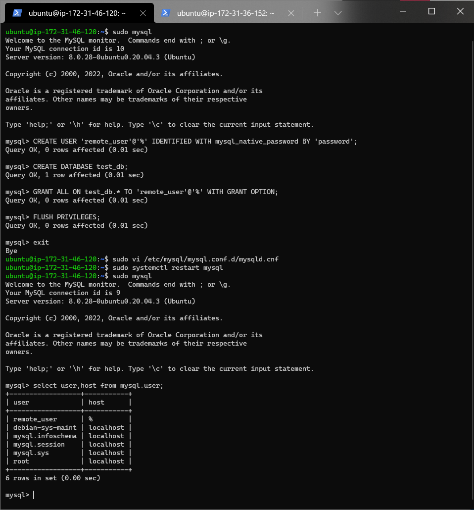

# Client Server Architecture using MySQL
## Introduction
Client-Server refers to an architecture in which two or more computers are connected together over a network to send and receive requests between one another.
## Prerequisites
* An AWS account and a virtual server with Ubuntu Server OS.
* A terminal to connect the AWS EC2 instances, i would be using the windows terminal for this project.
* Connect to your AWS EC2 instances.
## Step 1 - Building architecture components
1. Create and configure two Linux-based virtual servers (EC2 instances in AWS).

    Server A name - `mysql server`

    Server B name - `mysql client`

    

2. On `mysql server` Linux Server install MySQL Server software.

    Using the following commands:
    ```bash
    sudo apt update -y
    ```
    ```bash
    sudo apt install mysql-server
    ```
    To enable mysql 
    ```bash 
    sudo systemctl enable mysql 
    ```
    

3. On `mysql client` Linux Server install MySQL Client software.
    ```bash
    sudo apt update -y
    ```
    ```bash
    sudo apt install mysql-client
    ```
    

4. By default, both of the EC2 virtual servers are located in the same local virtual network, so they can communicate to each other using local IP addresses. Use mysql server's local IP address to connect from mysql client. MySQL server uses TCP port 3306 by default, so you will have to open it by creating a new entry in ‘Inbound rules’ in ‘mysql server’ Security Groups. 

    

    For extra security, do not allow all IP addresses to reach your ‘mysql server’ – allow access only to the specific local IP address of your ‘mysql client’, and configuration of database in picture below.

    

5. You might need to configure MySQL server to allow connections from remote hosts.
    ```bash
    sudo vi /etc/mysql/mysql.conf.d/mysqld.cnf
    ```
    

    Replace ‘127.0.0.1’ to ‘0.0.0.0’ like this:

    

6. From mysql client Linux Server connect remotely to mysql server Database Engine without using SSH. You must use the mysql utility to perform this action.

    

7. Check that you have successfully connected to a remote MySQL server and can perform SQL queries:
    ```bash
    Show databases;
    ```
    