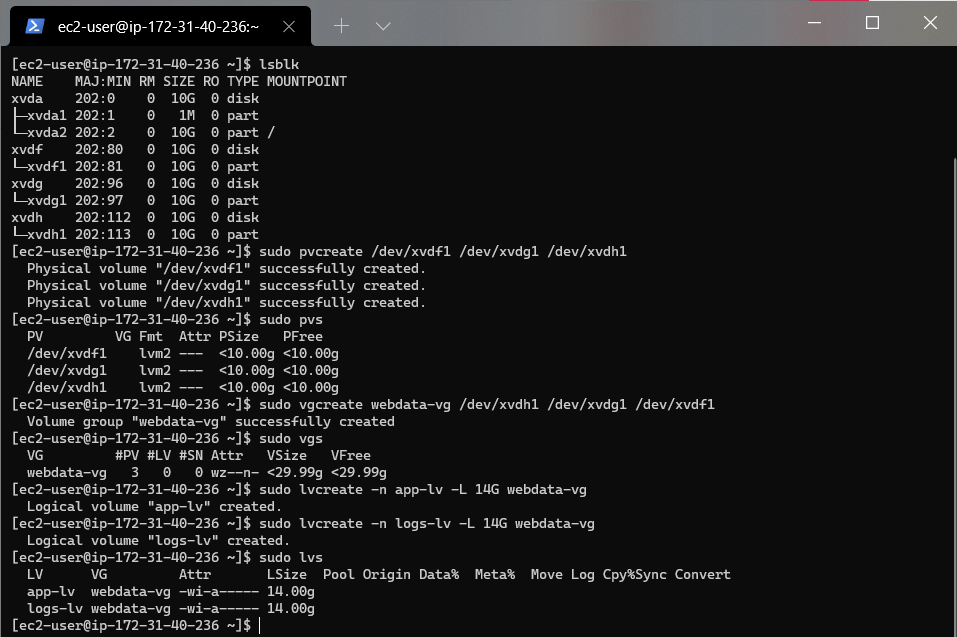

# WEB SOLUTION WITH WORDPRESS
## Introduction
This project involves the preparation of storage infrastructure on two Linux servers and implementation a basic web solution using WordPress. WordPress is a free and open-source content management system written in PHP and paired with MySQL or MariaDB as its backend Relational Database Management System (RDBMS).
## Requirements
Project 6 consists of two parts:
* Configure storage subsystem for Web and Database servers based on Linux OS.
* Install WordPress and connect it to a remote MySQL database server. 
## Prerequisites
* An AWS account and a virtual server with RedHat OS.
* A terminal to connect the AWS EC2 instances, i would be using the windows terminal for this project.
* Connect to your AWS EC2 instances.
## Step 2 - Prepare a Web Server
1. Launch an EC2 instance that will serve as "Web Server". Create 3 volumes in the same AZ as your Web Server EC2, each of 10 GiB.

     

2. Attach all three volumes one by one to your Web Server EC2 instance.

    

    Open up the Linux terminal to begin configuration
3. Use `lsblk` command to inspect what block devices are attached to the server. Notice names of your newly created devices. All devices in Linux reside in `/dev/`directory. Inspect it with ls `/dev/` and make sure you see all 3 newly created block devices there – their names will likely be `xvdf, xvdh, xvdg`.

    
4. Use `df -h` command to see all mounts and free space on your server
    
    

5. Use `gdisk` utility to create a single partition on each of the 3 disks
    ```bash
    sudo gdisk /dev/xvdf
    ```
    Use `lsblk` utility to view the newly configured partition on each of the 3 disks.

    

6. Install `lvm2` package using `sudo yum install lvm2`. Run `sudo lvmdiskscan` command to check for available partitions.

    

7. Use `pvcreate` utility to mark each of 3 disks as physical volumes (PVs) to be used by LVM.
    ```bash
    sudo pvcreate /dev/xvdf1
    sudo pvcreate /dev/xvdg1
    sudo pvcreate /dev/xvdh1
    ```
8. Verify that your Physical volume has been created successfully by running `sudo pvs`

9. Use `vgcreate` utility to add all 3 PVs to a volume group (VG). Name the VG `webdata-vg`.
    ```bash
    sudo vgcreate webdata-vg /dev/xvdh1 /dev/xvdg1 /dev/xvdf1
    ```
10. Verify that your VG has been created successfully by running `sudo vgs`

11. Use `lvcreate` utility to create 2 logical volumes. `apps-lv` (Use half of the PV size), and logs-lv Use the remaining space of the PV size. NOTE: apps-lv will be used to store data for the Website while, logs-lv will be used to store data for logs
    ```bash
    sudo lvcreate -n apps-lv -L 14G webdata-vg
    sudo lvcreate -n logs-lv -L 14G webdata-vg
    ```
12. Verify that your Logical Volume has been created successfully by running `sudo lvs`

    

13. Verify the entire setup
    ```bash 
    sudo vgdisplay -v #view complete setup - VG, PV, and LV
    sudo lsblk 
    ```
    
14. Use mkfs.ext4 to format the logical volumes with ext4 filesystem

    ```bash 
    sudo mkfs -t ext4 /dev/webdata-vg/apps-lv
    sudo mkfs -t ext4 /dev/webdata-vg/logs-lv
    ```
    
15. Create /var/www/html directory to store website files

    ```bash
    sudo mkdir -p /var/www/html
    ```
16.  Create /home/recovery/logs to store backup of log data

    ```bash
    sudo mkdir -p /home/recovery/logs
    ```
17. Mount /var/www/html on apps-lv logical volume

    ```bash
    sudo mount /dev/webdata-vg/apps-lv /var/www/html/
    ```
    
    

18. Use `rsync` utility to backup all the files in the log directory /var/log into /home/recovery/logs (This is required before mounting the file system)

    ```bash
    sudo rsync -av /var/log/. /home/recovery/logs/
    ```

19. Mount /var/log on logs-lv logical volume. (Note that all the existing data on /var/log will be deleted. That is why step 15 above is very
important)

    ```bash
    sudo mount /dev/webdata-vg/logs-lv /var/log
    ```

20. Restore log files back into /var/log directory
    ```bash
    sudo rsync -av /home/recovery/logs/. /var/log
    ```
    
    
21. Update /etc/fstab file so that the mount configuration will persist after restart of the server. The UUID of the device will be used to update the /etc/fstab file
    ```bash
    sudo blkid
    ```
    ```bash
    sudo vi /etc/fstab
    ```
    
    Update /etc/fstab in this format using your own UUID and rememeber to remove the leading and ending quotes.

    * Test the configuration and reload the daemon

    ```bash
    sudo mount -a
    sudo systemctl daemon-reload
    ```
    * Verify your setup by running `df -h`, output must look like this:

    


## Step 2 - Prepare the Database Server
1. Launch a second RedHat EC2 instance that will have a role – ‘DB Server’. Repeat the same steps as for the Web Server, but instead of apps-lv create db-lv and mount it to /db directory instead of /var/www/html/.

    

## Step 3 — Install WordPress on your Web Server EC2
1. Update the repository

    ```bash
    sudo yum -y update
    ```

2. Install wget, Apache and it’s dependencies

    ```bash
    sudo yum -y install wget httpd php php-mysqlnd php-fpm php-json
    ```
3. Start Apache

    ```bash
    sudo systemctl enable httpd
    sudo systemctl start httpd
    ```
    

4. To install PHP and it’s depemdencies

    ```bash
    sudo yum install https://dl.fedoraproject.org/pub/epel/epel-release-latest-8.noarch.rpm
    sudo yum install yum-utils http://rpms.remirepo.net/enterprise/remi-release-8.rpm
    sudo yum module list php
    sudo yum module reset php
    sudo yum module enable php:remi-7.4
    sudo yum install php php-opcache php-gd php-curl php-mysqlnd
    sudo systemctl start php-fpm
    sudo systemctl enable php-fpm
    setsebool -P httpd_execmem 1
    ```
    

5. Restart Apache

    ```bash
    sudo systemctl restart httpd
    ```
6. Download wordpress and copy wordpress to `var/www/html`
    ```bash
    mkdir wordpress
    cd   wordpress
    sudo wget http://wordpress.org/latest.tar.gz
    sudo tar xzvf latest.tar.gz
    sudo rm -rf latest.tar.gz
    cp wordpress/ wp-config-sample.php wordpress/wp-config.php
    cp -R wordpress /var/www/html/
    ```
7. Configure SELinux Policies
    ```bash
    sudo chown -R apache:apache /var/www/html/wordpress
    sudo chcon -t httpd_sys_rw_content_t /var/www/html/wordpress -R
    sudo setsebool -P httpd_can_network_connect=1
    ```
    

## Step 4 — Install MySQL on your DB Server EC2
1. Install MySQL on Database Server with the command below:
    ```bash
    sudo yum update
    sudo yum install mysql-server
    ```
2. Verify that the service is up and running by using `sudo systemctl status mysqld`, if it is not running, restart the service and enable it so it will be running even after reboot:
    ```bash
    sudo systemctl restart mysqld
    sudo systemctl enable mysqld
    ```
    

## Step 5 — Configure DB to work with WordPress
1. Give the web server in the case wordpress access to Database server
    ```bash
    sudo mysql
    CREATE DATABASE wordpress;
    CREATE USER `myuser`@`<Web-Server-Private-IP-Address>` IDENTIFIED BY 'mypass';
    GRANT ALL ON wordpress.* TO 'myuser'@'<Web-Server-Private-IP-Address>';
    FLUSH PRIVILEGES;
    SHOW DATABASES;
    exit
    ```
    

## Step 6 - Configure WordPress to connect to remote database.
1. Open MySQL port 3306 on DB Server EC2. For extra security, allow access to the DB server ONLY from your Web Server’s IP address, so in the Inbound Rule configuration specify source as /32.

2. Install MySQL client and test that you can connect from your Web Server to your DB server by using mysql-client
    ```bash
    sudo yum install mysql
    sudo mysql -u admin -p -h <DB-Server-Private-IP-address>
    ```
3. Verify if you can successfully execute SHOW DATABASES; command and see a list of existing databases.

4. Change permissions and configuration so Apache could use WordPress:

    
5. Enable TCP port 80 in Inbound Rules configuration for your Web Server EC2 (enable from everywhere 0.0.0.0/0 or from your workstation’s IP)

6. Try to access from your browser the link to your WordPress http://<Web-Server-Public-IP-Address>/wordpress/

    
